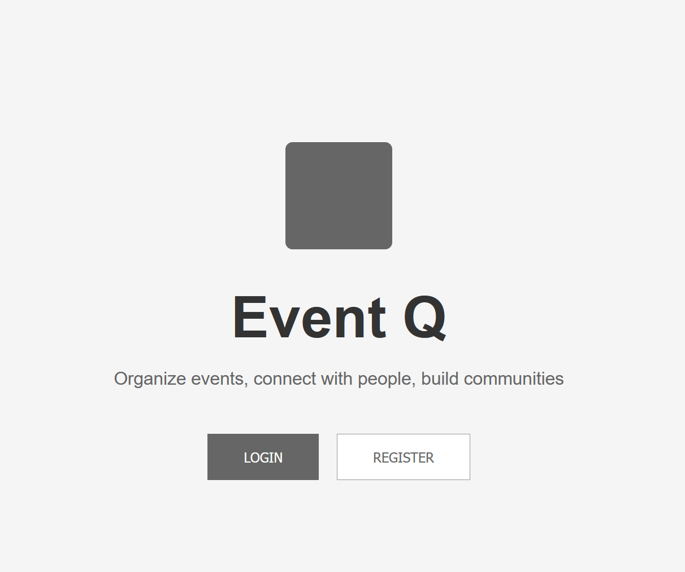
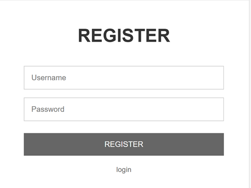
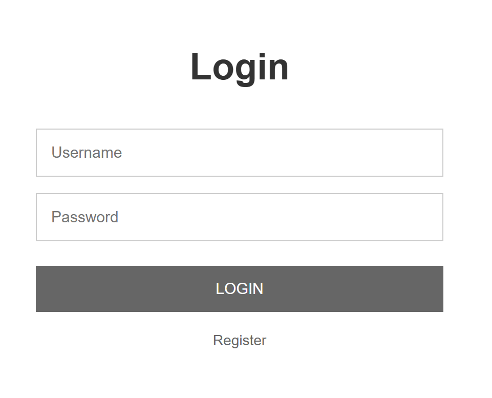
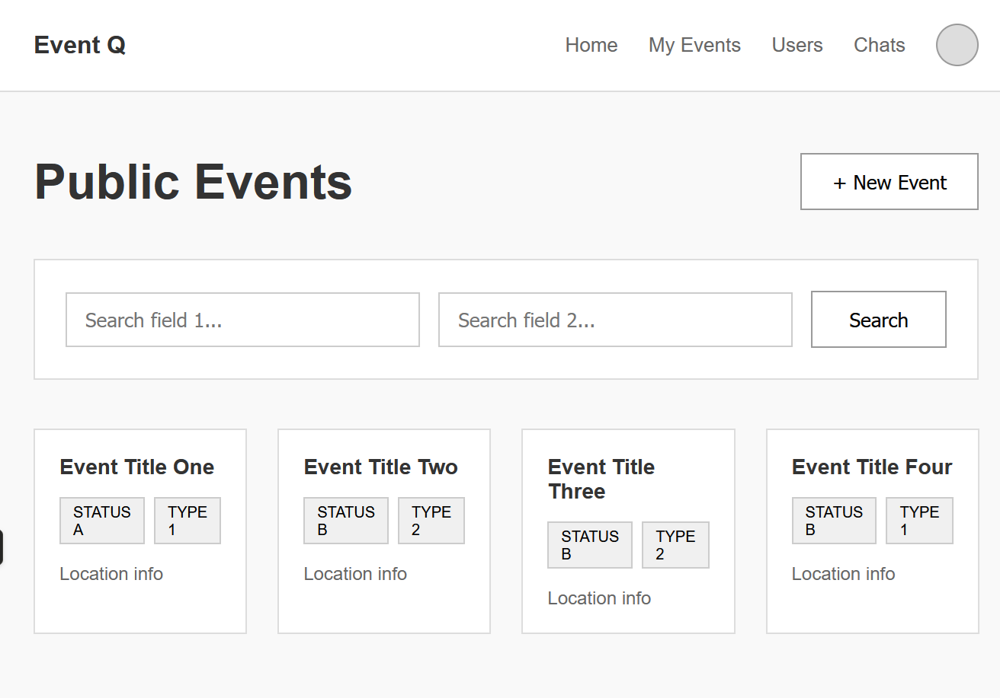
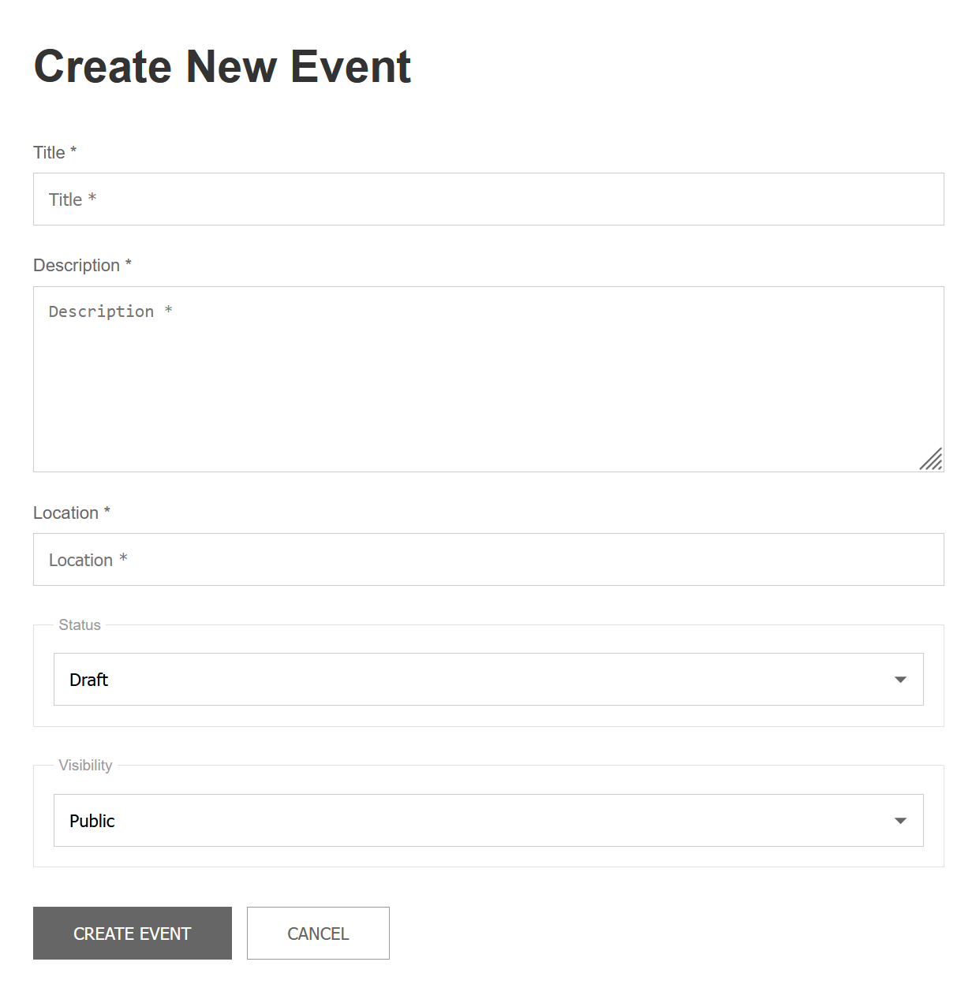
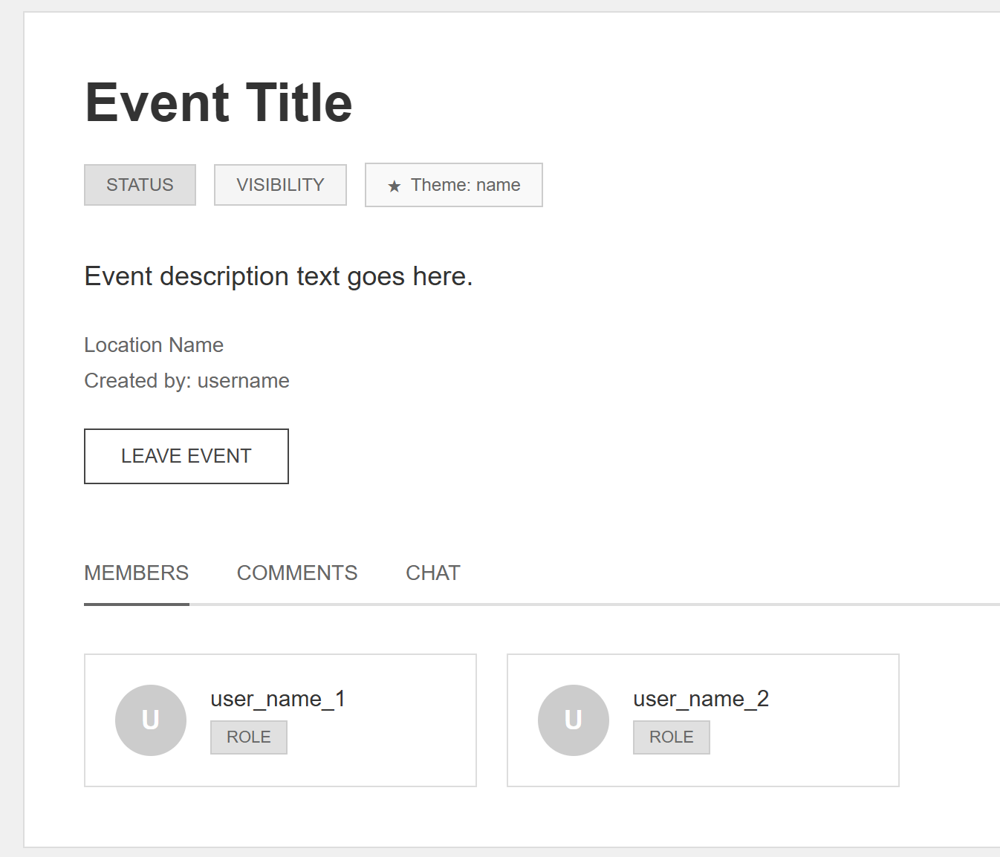
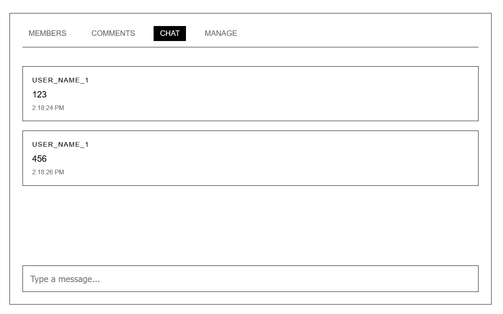
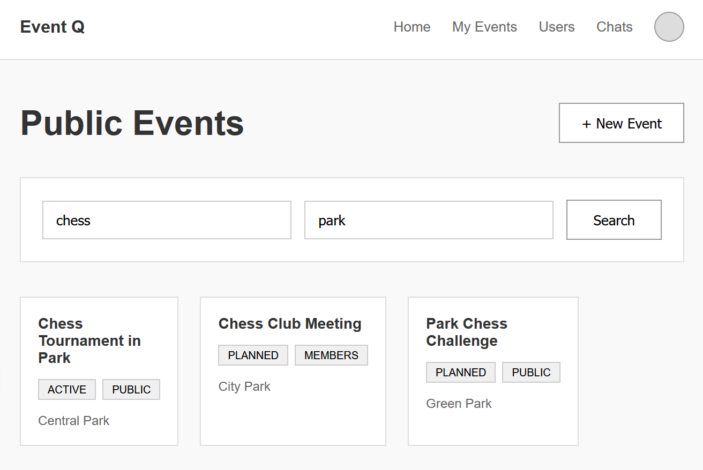
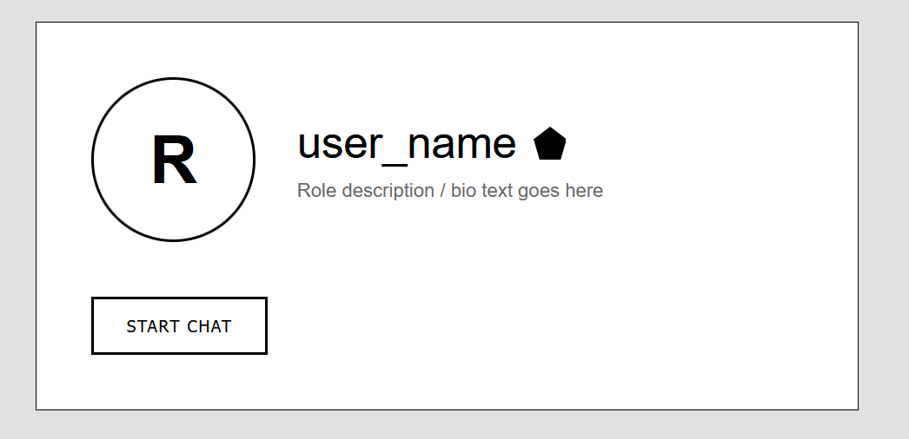

# Software Requirements Specification (SRS)
# EventQ - Crowd Searching Platform

**Версия:** 1.0

---
## Содержание
1. [Введение](#1-введение)
    - 1.1 [Назначение](#11-назначение)
    - 1.2 [Бизнес-требования](#12-бизнес-требования)
        - 1.2.1 [Исходные данные](#121-исходные-данные)
        - 1.2.2 [Возможности бизнеса](#122-возможности-бизнеса)
        - 1.2.3 [Границы проекта](#123-границы-проекта)
    - 1.3 [Аналоги](#13-аналоги)
2. [Требования пользователя](#2-требования-пользователя)
    - 2.1 [Программные интерфейсы](#21-программные-интерфейсы)
    - 2.2 [Интерфейс пользователя](#22-интерфейс-пользователя)
    - 2.3 [Характеристики пользователей](#23-характеристики-пользователей)
        - 2.3.1 [Классы пользователей](#231-классы-пользователей)
        - 2.3.2 [Аудитория приложения](#232-аудитория-приложения)
    - 2.4 [Предположения и зависимости](#24-предположения-и-зависимости)
3. [Системные требования](#3-системные-требования)
    - 3.1 [Функциональные требования](#31-функциональные-требования)
        - 3.1.1 [Основные функции](#311-основные-функции)
        - 3.1.2 [Ограничения и исключения](#312-ограничения-и-исключения)
    - 3.2 [Нефункциональные требования](#32-нефункциональные-требования)
        - 3.2.1 [Атрибуты качества](#321-атрибуты-качества)
        - 3.2.2 [Внешние интерфейсы](#322-внешние-интерфейсы)
        - 3.2.3 [Ограничения](#323-ограничения)

---

## 1 Введение

### 1.1 Назначение
Этот документ описывает функциональные и нефункциональные требования к платформе **EventQ** - системе поиска и организации мероприятий. Документ предназначен для команды разработчиков, тестировщиков и всех участников проекта, участвующих в реализации и верификации корректности работы приложения.

### 1.2 Бизнес-требования

### 1.2.1 Исходные данные
Люди часто сталкиваются с трудностями при организации мероприятий и поиске интересных событий. Существующие платформы либо слишком сложны, либо не предоставляют гибких настроек видимости мероприятий. Организаторам нужен простой способ создания событий с разным уровнем доступа, а участникам - удобный поиск и система коммуникации.

### 1.2.2 Возможности бизнеса
Платформа **EventQ** решает проблему организации мероприятий через систему "толпового поиска" (crowd searching), предоставляя гибкие настройки видимости событий и богатые возможности для коммуникации. Это позволяет создавать как открытые массовые события, так и эксклюзивные приватные мероприятия.

### 1.2.3 Границы проекта
**EventQ** - это веб-платформа для создания, поиска и управления мероприятиями с системой управления участниками, чатами и комментариями. Платформа не предоставляет функционала онлайн-оплат, интеграции с календарями или систем видеоконференций.

### 1.3 Аналоги
*   **Meetup.com:** Платформа для организации встреч по интересам. **Отличие:** EventQ предоставляет более гибкую систему управления видимостью и правами доступа.
*   **Facebook Events:** Система мероприятий в социальной сети. **Отличие:** EventQ специализирован на организации мероприятий с расширенными возможностями модерации и VIP-функциями.
*   **Eventbrite:** Платформа для организации платных мероприятий. **Отличие:** EventQ фокусируется на сообществах и гибких настройках доступа, а не на билетных операциях.

## 2 Требования пользователя

### 2.1 Программные интерфейсы
*   Backend приложения реализован на **Spring Boot** (Java)
*   Для хранения данных используется реляционная **SQL база данных** (PostgreSQL/MySQL)
*   Фронтенд реализован как SPA-приложение на современном JS-фреймворке
*   REST API для взаимодействия клиента и сервера

Я напишу описание мокапов в формате Markdown со ссылками на файлы. Вот обновленный раздел для вашего SRS документа:

---

### 2.2 Интерфейс пользователя

Визуальный дизайн, компоновка и пользовательский поток детально представлены в виде мокапов. Полная спецификация пользовательского интерфейса содержится в файлах мокапов, расположенных в директории проекта `docs/mockups/.

#### Основные экраны приложения:

**Лендинг** - Главная страница платформы с описанием возможностей и призывом к действию

**Регистрация** - Форма создания нового аккаунта в системе

**Авторизация** - Страница входа в существующий аккаунт

**Лента мероприятий** - Дашборд с мероприятиями, рекомендациями и поиском

**Создание мероприятия** - Форма для настройки всех параметров нового события

**Страница мероприятия** - Детальная информация о событии с чатом и комментариями

**Чат мероприятия** - Интерфейс общения участников события в реальном времени

**Приглашения** - Система управления приглашениями на мероприятия

**Поиск** - Результаты поиска мероприятий с фильтрацией

**Профиль пользователя** - Личный кабинет пользователя с настройками и активностью

**Мой профиль** - Страница редактирования персональных данных

### 2.3 Характеристики пользователей

### 2.3.1 Классы пользователей
| Класс пользователей | Описание |
| :--- | :--- |
| **Гости** | Неаутентифицированные пользователи. Могут просматривать публичные мероприятия. Не могут создавать контент или участвовать в коммуникации. |
| **Зарегистрированные пользователи** | Базовые аутентифицированные пользователи. Могут создавать мероприятия, участвовать в событиях, использовать чаты и комментарии. |
| **VIP пользователи** | Пользователи с премиум-статусом. Имеют приоритет в поиске, могут закреплять сообщения, использовать кастомные темы. |
| **Организаторы** | Создатели мероприятий. Управляют участниками, одобряют заявки, модерируют контент в своих событиях. |
| **Администраторы** | Системные модераторы. Имеют полный доступ ко всем мероприятиям, могут блокировать пользователей, управлять системным контентом. |

### 2.3.2 Аудитория приложения
#### 2.3.2.1 Целевая аудитория
- Организаторы мероприятий (от небольших встреч до конференций)
- Участники, ищущие интересные события
- Сообщества и клубы по интересам
- Бизнес-тренеры и коучи

#### 2.3.2.2 Побочная аудитория
- Учебные заведения для организации мероприятий
- Корпоративные пользователи для внутренних событий

### 2.4 Предположения и зависимости
*   Пользователи имеют доступ к современному веб-браузеру
*   Для полноценной работы необходим стабильный доступ в Интернет
*   Пользователи соглашаются с правилами платформы и политикой конфиденциальности

## 3 Системные требования

### 3.1 Функциональные требования

### 3.1.1 Основные функции

#### 3.1.1.1 Регистрация и аутентификация
**Описание.** Пользователь должен иметь возможность создать учетную запись или войти в существующую.

| Функция | Требования |
| :--- | :--- |
| **Регистрация** | Система запрашивает логин, пароль. |
| **Аутентификация** | Логин по логину и паролю. Поддержка восстановления пароля. |
| **Управление профилем** | Возможность редактирования профиля, загрузки аватара, настройки уведомлений. |

#### 3.1.1.2 Управление мероприятиями
**Описание.** Пользователи могут создавать, редактировать и управлять мероприятиями.

| Функция | Требования |
| :--- | :--- |
| **Создание мероприятия** | Название, описание, дата/время, тип видимости (публичный/по заявке/приватный), категория, теги. |
| **Типы видимости** | Публичный (видны всем, можно присоединиться), По заявке (видны всем, требуется одобрение), Приватный (только по приглашению) |
| **Поиск мероприятий** | Фильтрация по категориям, дате, местоположению, типу события. |
| **Управление участниками** | Просмотр участников, одобрение/отклонение заявок, назначение организаторов, блокировка пользователей. |

#### 3.1.1.3 Система коммуникации
**Описание.** Многоуровневая система общения между участниками мероприятий.

| Функция | Требования |
| :--- | :--- |
| **Комментарии к событиям** | Древовидная структура комментариев. Видны всем, кто имеет доступ к просмотру мероприятия. |
| **Чат мероприятия** | Линейный чат для участников события. Только для присоединившихся пользователей. |
| **Личные сообщения** | Приватная переписка между пользователями. |
| **Закрепление сообщений** | VIP пользователи и организаторы могут закреплять важные сообщения в чате. |

#### 3.1.1.4 VIP функционал
**Описание.** Премиум-возможности для пользователей с VIP-статусом.

**Требования:**
- Приоритетное отображение в результатах поиска
- Возможность закрепления сообщений в чатах мероприятий
- Кастомные темы для мероприятий
- Расширенные статистики посещаемости

#### 3.1.1.5 Административные функции
**Описание.** Управление платформой и модерация контента.

| Функция | Требования |
| :--- | :--- |
| **Модерация мероприятий** | Просмотр и редактирование любых мероприятий, блокировка несоответствующего контента. |
| **Управление пользователями** | Блокировка/разблокировка пользователей, назначение VIP-статуса, просмотр статистики. |
| **Системные отчеты** | Аналитика по активности платформы, популярным категориям, пользовательской активности. |
| **Управление категориями** | Создание и редактирование категорий мероприятий. |

#### 3.1.1.6 Уведомления
**Описание.** Система оповещений о важных событиях.

**Требования:**
- Уведомления о новых комментариях и сообщениях в чате
- Оповещения о заявках на участие в мероприятиях
- Системные уведомления от администрации
- Email-рассылки о предстоящих мероприятиях

### 3.1.2 Ограничения и исключения
*   Платформа не гарантирует заполнение реальными данными (ответственность на организаторах)
*   Максимальное количество участников на одно мероприятие: 10,000
*   Функционал видео-конференций не входит в первоначальную версию

### 3.2 Нефункциональные требования

### 3.2.1 Атрибуты качества

#### 3.2.1.1 Требования к удобству использования
*   Интерфейс должен быть интуитивно понятен для пользователей с разным уровнем технической подготовки
*   Время обучения базовым функциям - не более 10 минут
*   Навигация между разделами - не более 3 кликов

#### 3.2.1.2 Требования к производительности
*   Время загрузки страницы: не более 2 секунд
*   Время отклика на действия пользователя: не более 1 секунды
*   Поддержка одновременной работы 10,000 пользователей

#### 3.2.1.3 Требования к безопасности
*   Хранение паролей в хэшированном виде (bcrypt)
*   HTTPS для всех соединений
*   Валидация и санитизация пользовательского ввода
*   Защита от XSS и CSRF атак
*   Разграничение прав доступа между ролями пользователей

#### 3.2.1.4 Требования к надежности
*   Доступность системы: 99.5%
*   Автоматическое резервное копирование данных ежедневно
*   Восстановление после сбоев в течение 1 часа

### 3.2.2 Внешние интерфейсы
*   **REST API** для мобильных приложений и интеграций
*   **WebSocket** для реального времени в чатах
*   **Email SMTP** для уведомлений и рассылок
*   **Адаптивный веб-интерфейс** для десктопных и мобильных устройств

### 3.2.3 Ограничения
*   Backend: Spring Boot (Java 17+)
*   База данных: PostgreSQL 14+
*   Frontend: Modern JavaScript framework (React/Vue/Angular)
*   Поддержка браузеров: Chrome 90+, Firefox 88+, Safari 14+
*   Сервер: Linux-based с минимальными требованиями 4GB RAM, 2 CPU cores

---
