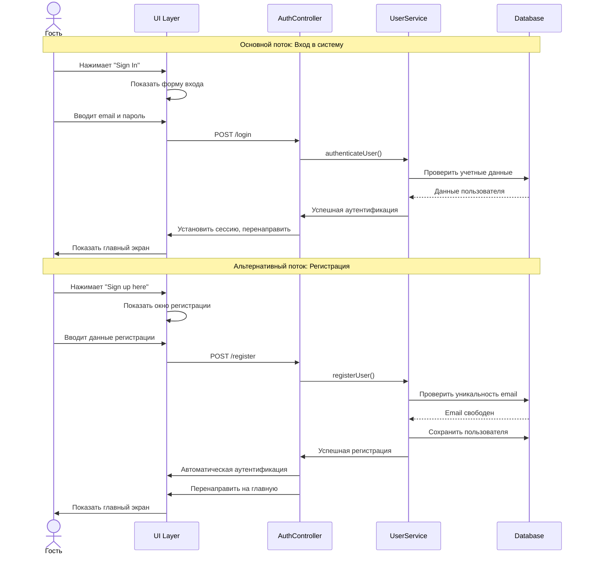
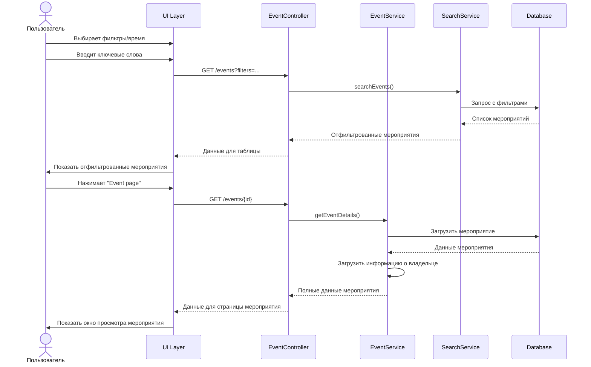
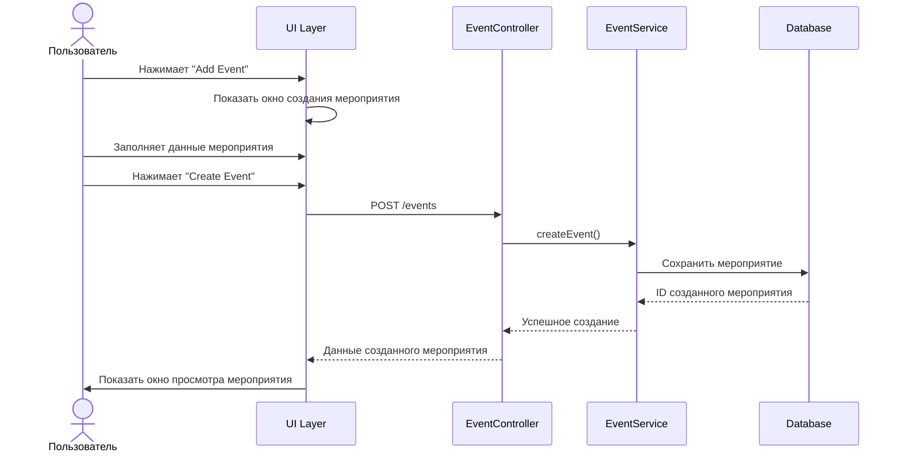

# Диаграммы последовательностей и активностей

## Диаграмма последовательности 1: Регистрация и вход в систему

**Описание:** Процесс регистрации нового пользователя и входа в систему

## Диаграмма последовательности 2: Поиск и просмотр публичных мероприятий

**Описание:** Процесс поиска мероприятий по фильтрам и просмотра деталей мероприятия

## Диаграмма последовательности 3: Создание мероприятия

**Описание:** Процесс создания нового мероприятия

