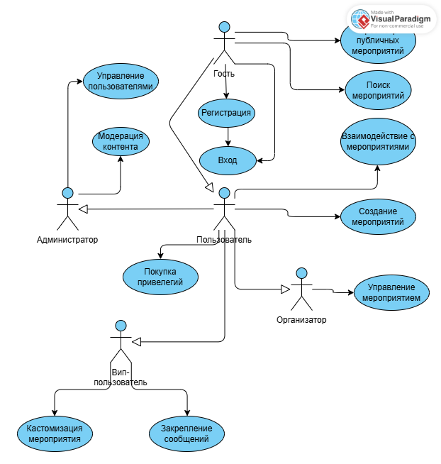

# Use Case Представление (Обновленное)

## Диаграмма вариантов использования

## Глоссарий

| Термин | Определение |
|--------|-------------|
| **Гость** | Неаутентифицированный пользователь веб-приложения. Может просматривать публичный контент. Для создания и управления личным контентом требуется регистрация и аутентификация. |
| **Пользователь** | Аутентифицированный зарегистрированный пользователь приложения. Может создавать, просматривать, редактировать и удалять свои мероприятия, а также просматривать публичные мероприятия других пользователей. |
| **Организатор** | Пользователь, создающий и управляющий мероприятиями. Имеет расширенные права на управление созданными мероприятиями. |
| **VIP-пользователь** | Пользователь с дополнительными привилегиями, включая кастомизацию мероприятий и закрепление сообщений. |
| **Администратор** | Привилегированный пользователь, отвечающий за управление системой, модерацию контента и техническую поддержку. Имеет доступ ко всем функциям системы. |
| **Мероприятие (Event)** | Организованное событие, встреча или активность. Содержит название, описание, дату, время, местоположение и тип мероприятия. |
| **Публичное мероприятие** | Мероприятие, созданное пользователем и доступное для просмотра всем посетителям приложения, включая гостей. |
| **Приватное мероприятие** | Мероприятие, созданное пользователем и доступное только приглашенным участникам. |

## Содержание

1. [Актеры](#1-актеры)
2. [Варианты использования](#2-варианты-использования)
   - [2.1 Зарегистрироваться](#21-зарегистрироваться)
   - [2.2 Войти в систему](#22-войти-в-систему)
   - [2.3 Просмотреть публичные мероприятия](#23-просмотреть-публичные-мероприятия)
   - [2.4 Поиск мероприятий](#24-поиск-мероприятий)
   - [2.5 Создать мероприятие](#25-создать-мероприятие)
   - [2.6 Управление профилем](#26-управление-профилем)
   - [2.7 Покупка привилегий](#27-покупка-привилегий)
   - [2.8 Кастомизация мероприятия](#28-кастомизация-мероприятия)
   - [2.9 Закрепление сообщений](#29-закрепление-сообщений)
   - [2.10 Модерация контента](#210-модерация-контента)
   - [2.11 Управление пользователями](#211-управление-пользователями)

## 1. Актеры

| Актер | Описание |
|-------|-----------|
| **Гость** | Неаутентифицированный пользователь веб-приложения. Может просматривать публичный контент. Для создания и управления личным контентом требуется регистрация и аутентификация. |
| **Пользователь** | Аутентифицированный зарегистрированный пользователь приложения. Может создавать, просматривать, редактировать и удалять свои мероприятия, а также просматривать публичные мероприятия других пользователей. |
| **Организатор** | Пользователь, создающий и управляющий мероприятиями. Имеет расширенные права на управление созданными мероприятиями. |
| **VIP-пользователь** | Пользователь с дополнительными привилегиями, включая кастомизацию мероприятий и закрепление сообщений. |
| **Администратор** | Привилегированный пользователь, отвечающий за управление системой, модерацию контента и техническую поддержку. |

## 2. Варианты использования

### 2.1 Зарегистрироваться

**Описание**  
Вариант использования "Зарегистрироваться" позволяет Гостю создать новую учётную запись в системе.

**Основной актер**  
Гость

**Предусловия**  
Гость находится на главной странице или на странице аутентификации.

**Основной поток**
1. Гость нажимает кнопку "Зарегистрироваться"
2. Система отображает форму регистрации, запрашивая имя пользователя и пароль
3. Гость вводит имя пользователя и пароль, подтверждает пароль и отправляет форму
4. Система проверяет уникальность имени пользователя и соответствие пароля политике безопасности
5. Система создаёт новую учётную запись Пользователя, хэширует пароль и автоматически аутентифицирует его
6. Система перенаправляет Пользователя на его личную главную страницу
7. Вариант использования завершается

**Альтернативный поток А1: Данные невалидны**
- Если введённые данные не проходят проверку (имя пользователя занято, пароль слишком простой, пароли не совпадают), система отображает соответствующее сообщение об ошибке
- Возврат к пункту 3 основного потока

**Альтернативный поток А2: Отмена регистрации**
- Гость нажимает кнопку "Отмена" или возвращается на предыдущую страницу до подтверждения отправки формы
- Система возвращает Гостя на страницу, с которой был начат процесс регистрации
- Вариант использования завершается досрочно

**Постусловия**  
В системе создана новая учётная запись. Гость получает статус "Пользователь" и аутентифицирован в системе.

### 2.2 Войти в систему

**Описание**  
Вариант использования "Войти в систему" позволяет зарегистрированному Пользователю аутентифицироваться в системе.

**Основной актер**  
Гость

**Предусловия**  
Пользователь не аутентифицирован (Гость) и находится на главной странице или на странице аутентификации.

**Основной поток**
1. Гость нажимает кнопку "Войти"
2. Система отображает форму входа, запрашивая имя пользователя и пароль
3. Пользователь вводит свои учетные данные и отправляет форму
4. Система проверяет наличие пользователя с такими данными и соответствие введённого пароля хэшу в базе данных
5. При успешной проверке система создаёт сессию и перенаправляет Пользователя на его личную главную страницу
6. Вариант использования завершается

**Альтернативный поток А1: Неверные учётные данные**
- Если имя пользователя или пароль неверны, система отображает общее сообщение об ошибке аутентификации ("Неверный логин или пароль")
- Возврат к пункту 3 основного потока

**Постусловия**  
Пользователь аутентифицирован в системе и имеет доступ к своему личному контенту.

### 2.3 Просмотреть публичные мероприятия

**Описание**  
Вариант использования позволяет любому посетителю приложения (Гостю или Пользователю) просматривать мероприятия, которые были опубликованы как публичные.

**Основной актер**  
Гость, Пользователь

**Предусловия**  
Актер находится в приложении.

**Основной поток**
1. Актер переходит в раздел "Мероприятия" или "Публичные мероприятия"
2. Система отображает ленту или список публичных мероприятий, созданных всеми пользователями. Для каждого мероприятия отображается название, организатор, дата, время и краткое описание
3. Актер выбирает (кликает) на понравившееся мероприятие для просмотра деталей
4. Система открывает страницу мероприятия, где отображается полное описание, детальная информация и список участников (если применимо)
5. Вариант использования завершается

**Альтернативный поток А1: Публичные мероприятия отсутствуют**
- Если в системе нет ни одного публичного мероприятия, система отображает сообщение "Публичные мероприятия пока не добавлены"

**Постусловия**  
Актер ознакомился с содержимым публичного мероприятия.

### 2.4 Поиск мероприятий

**Описание**  
Вариант использования позволяет Гостю или Пользователю находить мероприятия по ключевым словам и фильтрам.

**Основной актер**  
Гость, Пользователь

**Предусловия**  
Актер находится в разделе публичных мероприятий.

**Основной поток**
1. Актер вводит ключевые слова в поле поиска и/или выбирает фильтры (по типу мероприятия, дате, местоположению)
2. Актер нажимает кнопку "Поиск" или система автоматически начинает поиск при вводе
3. Система проверяет каждое мероприятие на соответствие заданным критериям
4. Система отображает только те мероприятия, которые соответствуют условиям поиска
5. Актер может просматривать найденные мероприятия
6. Вариант использования завершается

**Альтернативный поток А1: Мероприятия не найдены**
- Если ни одно мероприятие не соответствует критериям поиска, система отображает сообщение "По вашему запросу ничего не найдено"
- Актер может изменить параметры поиска

**Альтернативный поток А2: Сброс поиска**
- Актер нажимает кнопку "Сбросить" для очистки фильтров
- Система возвращает отображение всех публичных мероприятий
- Вариант использования завершается

**Постусловия**  
Актер получил список мероприятий, соответствующих критериям поиска.

### 2.5 Создать мероприятие

**Описание**  
Вариант использования позволяет Пользователю создать новое мероприятие.

**Основной актер**  
Пользователь, Организатор

**Предусловия**  
Пользователь аутентифицирован в системе.

**Основной поток**
1. Пользователь переходит в раздел "Мои мероприятия" и нажимает кнопку "Создать мероприятие"
2. Система отображает форму создания мероприятия с полями: название, описание, дата, время, местоположение, тип мероприятия, статус видимости (публичный/приватный)
3. Пользователь заполняет основные данные мероприятия
4. Пользователь нажимает кнопку "Создать мероприятие"
5. Система проверяет, что указано название и дата мероприятия
6. Система сохраняет новое мероприятие в базу данных
7. Система отображает сообщение об успехе и перенаправляет Пользователя на страницу созданного мероприятия
8. Вариант использования завершается

**Альтернативный поток А1: Данные мероприятия невалидны**
- Если обязательные поля не заполнены, система отображает соответствующее сообщение об ошибке
- Возврат к пункту 4 основного потока

**Альтернативный поток А2: Отмена создания мероприятия**
- Пользователь нажимает кнопку "Отмена" до сохранения мероприятия
- Система запрашивает подтверждение отмены
- При подтверждении система возвращает Пользователя на страницу списка мероприятий без сохранения данных
- Вариант использования завершается досрочно

**Постусловия**  
В системе создано новое мероприятие, связанное с Пользователем. Если мероприятие публичное, оно становится видно другим пользователям и гостям.

### 2.6 Управление профилем

**Описание**  
Вариант использования позволяет Пользователю просматривать и редактировать данные своего профиля.

**Основной актер**  
Пользователь

**Предусловия**  
Пользователь аутентифицирован в системе.

**Основной поток**
1. Пользователь переходит в раздел "Мой профиль"
2. Система отображает текущие данные профиля
3. Пользователь нажимает кнопку "Редактировать"
4. Система отображает форму редактирования профиля
5. Пользователь вносит изменения в данные профиля
6. Пользователь нажимает кнопку "Сохранить"
7. Система сохраняет изменения и отображает сообщение об успехе
8. Вариант использования завершается

### 2.7 Покупка привилегий

**Описание**  
Вариант использования позволяет Пользователю приобрести VIP-статус или другие привилегии.

**Основной актер**  
Пользователь

**Предусловия**  
Пользователь аутентифицирован в системе.

**Основной поток**
1. Пользователь переходит в раздел "Привилегии"
2. Система отображает доступные пакеты привилегий
3. Пользователь выбирает желаемый пакет и нажимает "Купить"
4. Система обрабатывает платеж и активирует привилегии
5. Система уведомляет пользователя об успешной покупке
6. Вариант использования завершается

### 2.8 Кастомизация мероприятия

**Описание**  
Вариант использования позволяет VIP-пользователю настраивать внешний вид и дополнительные функции мероприятий.

**Основной актер**  
VIP-пользователь

**Предусловия**  
Пользователь имеет VIP-статус и является организатором мероприятия.

**Основной поток**
1. VIP-пользователь переходит к редактированию мероприятия
2. Система предоставляет дополнительные опции кастомизации
3. Пользователь настраивает внешний вид
4. Пользователь сохраняет изменения
5. Система применяет кастомизацию к мероприятию
6. Вариант использования завершается

### 2.9 Закрепление сообщений

**Описание**  
Вариант использования позволяет VIP-пользователю закреплять важные сообщения в обсуждениях мероприятий.

**Основной актер**  
VIP-пользователь

**Предусловия**  
Пользователь имеет VIP-статус и участвует в мероприятии.

**Основной поток**
1. VIP-пользователь выбирает сообщение в обсуждении мероприятия
2. Пользователь нажимает опцию "Закрепить сообщение"
3. Система перемещает сообщение в верхнюю часть обсуждения
4. Сообщение помечается как закрепленное
5. Вариант использования завершается

### 2.10 Модерация контента

**Описание**  
Вариант использования позволяет Администратору модерировать пользовательский контент.

**Основной актер**  
Администратор

**Предусловия**  
Пользователь имеет права администратора.

**Основной поток**
1. Администратор просматривает мероприятия чаты и профили пользователей
2. Система предоставляет инструменты модерации
3. Администратор принимает решение (оставить ,удалить, изменить)
4. Система применяет выбранное действие
5. Вариант использования завершается

### 2.11 Управление пользователями

**Описание**  
Вариант использования позволяет Администратору управлять учетными записями пользователей.

**Основной актер**  
Администратор

**Предусловия**  
Пользователь имеет права администратора.

**Основной поток**
1. Администратор переходит в панель управления пользователями
2. Система отображает список всех пользователей
3. Администратор выбирает пользователя и выполняет действие (блокировка, смена роли и т.д.)
4. Система применяет выбранное действие
5. Вариант использования завершается
